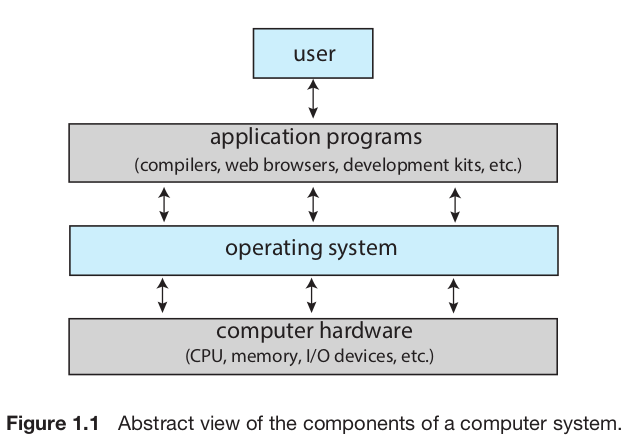

## Index
* [What Operating Systems do](#what-operating-systems-do)
* [Computer System Organization](#computer-system-organization)
* [Computer System Architecture](#computer-system-architecture)
* [Operating System Operations](#operating-system-operations)

# Introduction

이 챕터에서는 컴퓨터 시스템의 주요 요소들과 운영체제가 제공하는 주요 기능들에 대해 살펴본다.
추가적으로, 운영체제에서 사용되는 자료구조와 컴퓨터 환경, 여러 유명한 운영체제에 대한 간략한 설명을 포함한다.
운영체제는 보통 **kernel**, **system programs**, **application programs**, **middle wares**로 구성된다.

## What Operating Systems Do
**Keywords: User view, System view**

운영체제의 주요 기능은 자원의 적절한 분배이다. 
이를 **사용자 관점**과 **시스템 관점***에서 살펴보자.

### User view

**사용자 관점**에서 운영체제는 사용자가 컴퓨터를 쉽게 활용할 수 있도록 편의를 제공해준다.
예를 들어, 키보드, 마우스, 터치 스크린, 또는 음성 인식같은 입출력 장치들을 관리한다.
*임베디드 운영체제*와 같이 특수한 운영체제는 사용자 관점에 대하여 전혀 고려하지 않는 경우가 있다.

### System view

**시스템 관점**에서 운영체제는 자원을 분배하고 시스템에 대한 부적절한 입력을 통제한다.
컴퓨터 시스템에서의 자원이란 다음과 같다: CPU time, memory space, storage space, I/O devices 등.
