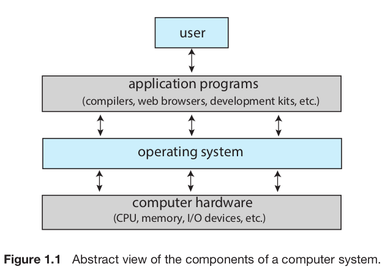
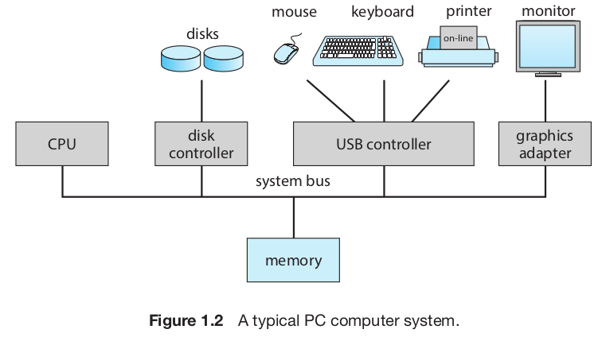
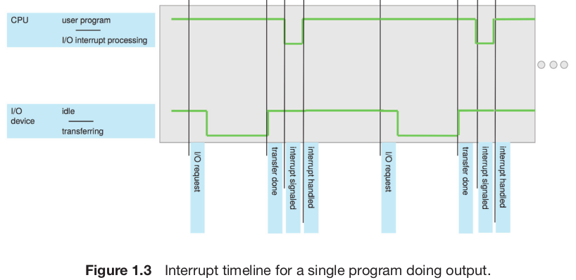

## Index
* [What Operating Systems do](#what-operating-systems-do)
* [Computer System Organization](#computer-system-organization)
* [Computer System Architecture](#computer-system-architecture)
* [Operating System Operations](#operating-system-operations)

# Introduction

이 챕터에서는 컴퓨터 시스템의 주요 요소들과 운영체제가 제공하는 주요 기능들에 대해 살펴본다. 
추가적으로, 운영체제에서 사용되는 자료구조와 컴퓨터 환경, 여러 유명한 운영체제에 대한 간략한 설명을 포함한다. 
운영체제는 **kernel**, **system program**, **application program**, **middle ware**로 구성된다.

## What Operating Systems Do
**Keywords: User interaction, Resource management**

운영체제의 주요 기능은 **자원의 분배**이다. 
이를 사용자 관점과 시스템 관점에서 살펴보자.

### User view

사용자 관점에서 운영체제는 **사용자가 컴퓨터를 활용할 수 있도록 인터페이스를 제공**해준다. 
*임베디드 운영체제*와 같이 특수한 운영체제는 사용자 관점에 대하여 전혀 고려하지 않는 경우가 있다.

### System view

시스템 관점에서 운영체제는 **자원을 분배**하고 시스템에 대한 부적절한 요청을 통제한다. 
컴퓨터 시스템에서의 자원이란 다음과 같다: CPU time, memory space, storage space, I/O device 등.

## Computer System Organization
**Keywords: Interrupt, Storage structure, I/O structure**

컴퓨터에 연결된 외부 장치들은 *device controller*를 가지고 있고 운영체제는 이에 대응하는 *device driver*를 관리한다. 
CPU와 *device controller*는 동시에 작동할 수 있기 때문에 공유 메모리에 대한 유효한 접근을 보장하기 위해 메모리 컨트롤러가 메모리 접근을 조율한다. 
그런 동작이 어떻게 이루어지는지 **Interrupt**, **Storage structure**, **I/O structure**라는 세가지 중심요소를 살펴본다.

### Interrupt

키보드 입력을 읽는 경우에, *device driver*는 *device controller*의 레지스터를 조작하고, *device controller*는 이 레지스터를 통해 
어떤 동작을 수행할지 결정하고 실행한다. 동작이 키보드 입력을 읽는 것이었기 때문에 *device controller*는 자신의 local buffer에 입력을 저장하고 
*device driver*에게 operation을 완료했음을 알린다. 그러면 *device driver*는 control을 반납하고 읽은 데이터에 대한 포인터를 반환할 것이다. 
그렇다면 *device controller*는 어떻게 *device driver*에게 동작을 완료했음을 알릴까? 이는 **Interrupt**에 의해 구현된다.

#### Overview

하드웨어는 CPU에 신호를 보냄으로서 **Interrupt**를 발생시킨다. (보통 *System bus*를 통해 신호를 보낸다.) 
CPU가 신호를 받으면 하던 일을 멈추고 신호에 따라 OS에 정의되어 있는 적절한 루틴을 실행한다. 루틴이 끝나면 CPU는 하던 일을 재개한다.

**Interrupt**는 자주 발생하기 때문에 빠르게 처리되어야 한다. 따라서 루틴에 대한 포인터의 배열이 사용된다. 
일반적으로 이 배열은 메모리의 낮은 주소에 위치하고 다양한 장치에 대한 루틴의 시작 위치를 저장하고 있다. 이는 *Interrupt Vector*라고 불린다.

#### Implementation

### Storage structure
### I/O structure
